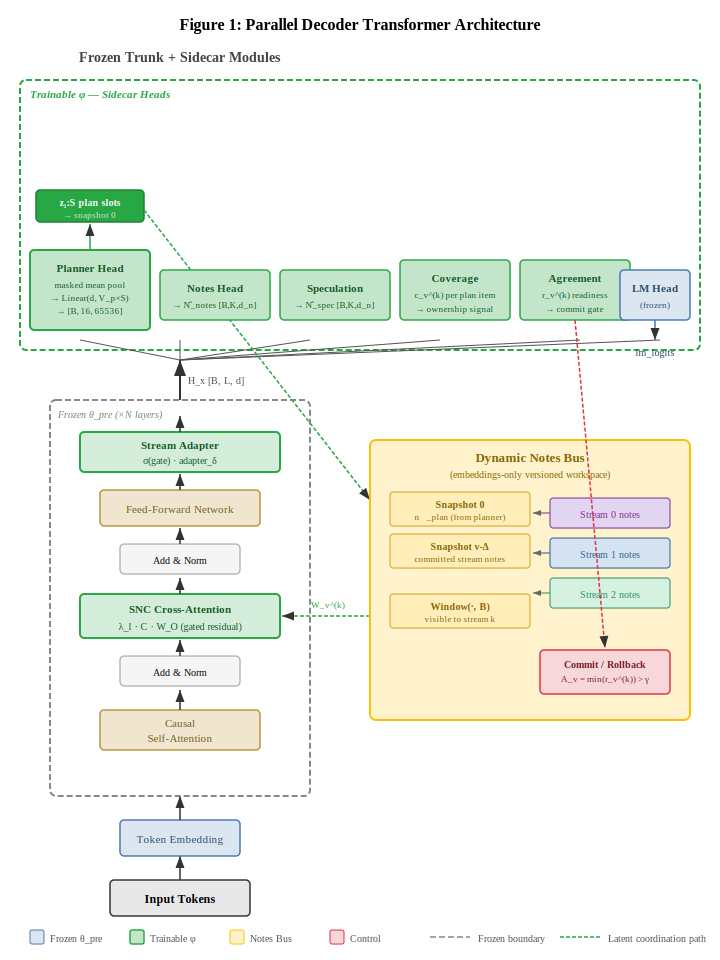
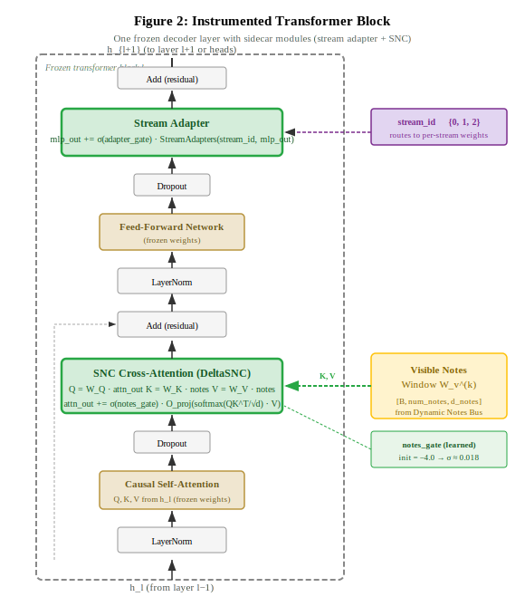
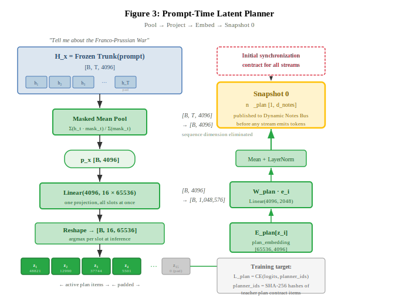
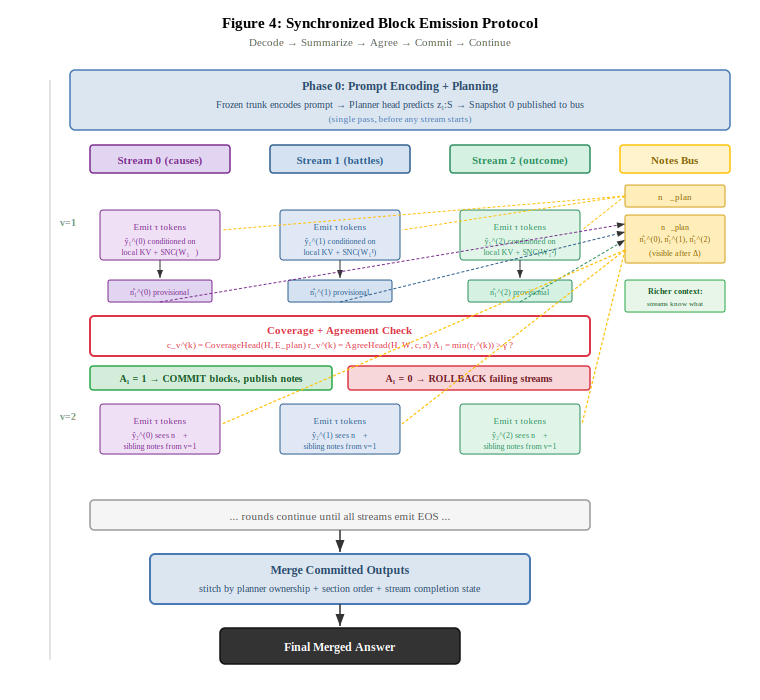

# Parallel Decoder Transformer

A proposed frozen-trunk architecture that augments a decoder with a planner-seeded latent workspace and a synchronized multi-stream output protocol. This repository contains the reference implementation accompanying the paper, including the full model architecture, dataset generation pipeline, and training infrastructure.

PDT proposes shifting parallel task decomposition from an external prompting strategy to a model-internal coordination mechanism over the output interface of a frozen language model. It is a proposal for how a single decoder can internally coordinate multiple generation streams so that their outputs remain coherent without relying on external orchestration, text-mediated communication, or post-hoc merging. In the future, we may explore the limits of what internal cordination mechanisms may unlock in terms of altering stream trajectory in-flight.

**Paper:** 
- https://arxiv.org/abs/2512.10054
- [docs/arxiv_submission/PAPER.md](docs/arxiv_submission/PAPER.md) (markdown)

## Proposed Architecture

The PDT mechanism works as follows: before any stream emits tokens, a mandatory prompt-time planner predicts fixed latent plan slots and projects them as snapshot 0 on an embeddings-only Dynamic Notes Bus. During decoding, each stream reads the visible notes window through Speculative Note Conditioning (SNC), emits provisional token blocks and latent summaries, and advances only when agreement logic determines that the current shared state is sufficient for continued parallel generation. Coverage heads track plan-item ownership, while rollback handles incoherent or premature commits.


*Figure 1: High-level architecture. The frozen trunk (left) is augmented with trainable sidecar modules (green): stream adapters and SNC cross-attention injected into selected transformer blocks, plus planner, notes, coverage, agreement, and speculation heads. The Dynamic Notes Bus (right) serves as the shared latent coordination workspace.*

### Instrumented Transformer Block

Each instrumented block adds two gated residual paths to the frozen trunk: SNC cross-attention (reading from the notes bus) and a stream adapter (providing stream-specific conditioning). Both injection points use learned gates initialized near zero so the frozen trunk's behavior is preserved early in training.


*Figure 2: A single instrumented transformer block. After causal self-attention, SNC cross-attention injects a gated residual from the visible notes window. After the feed-forward network, the stream adapter adds a gated stream-specific residual. All frozen weights (tan) are unchanged; only sidecar modules (green) receive gradients.*

### Prompt-Time Latent Planner

The planner operates on the complete prompt representation, masked-mean-pooled into a single vector, then projected into 16 slot logits over a 65,536-entry latent vocabulary. Each slot selects a latent plan item, which is re-embedded through a shared plan embedding matrix, projected into notes space, and published as snapshot 0.


*Figure 3: The prompt-time latent planner. The planner sees the full query before decomposing it into parallel plan items.*

### Synchronized Block Emission Protocol

Streams decode in synchronized rounds. At each block boundary, streams emit provisional latent notes, and coverage + agreement heads evaluate commit readiness. The system either commits (advancing the frontier) or rolls back failing streams. Each successive round sees a richer notes window as committed sibling summaries become visible after delay Delta.


*Figure 4: The synchronized block emission protocol across multiple rounds.*

## Repository Structure

```
src/parallel_decoder_transformer/
  models/                  # PDT model: frozen trunk, stream adapters, SNC backend, heads
    heads/                 # Planner, notes, speculation, coverage, agreement, stream classifier
    parallel_decoder_transformer.py
    snc_backend.py         # Speculative Note Conditioning cross-attention
    stream_adapters.py
  inference/               # Multi-stream orchestrator, DNB bus, gate logic, replay
    orchestrator.py        # Synchronized block emission + commit/rollback loop
    dnb_bus.py             # Dynamic Notes Bus implementation
    snc_cross_attn.py      # SNC cross-attention during decode
  training/                # Trainer with staged curriculum, dataset loader
  datasets/                # 5-stage dataset generation pipeline
  evaluation/              # Manifest metrics, attribute consistency scoring
  baselines/               # Sequential and token-level baseline wrappers

scripts/
  train.py                 # Training entry point
  train_wandb.py           # WandB-enabled training for remote runs
  infer.py                 # Inference CLI (parallel + baseline modes)
  run_dataset_pipeline.py  # End-to-end dataset generation driver
  run_benchmark.sh         # Sequential vs parallel comparison harness

configs/
  gpt_oss_transfer.yaml              # Development config
  gpt_oss_transfer_production.yaml   # Production config (8x B200)
  dataset/                            # Dataset generation configs
```

## Training Pipeline

The proposed training uses a parameter-efficient approach where the GPT-OSS-20B trunk remains frozen throughout. Only lightweight sidecar modules are trained (<5% of total parameters).

### Dataset Generation

The dataset pipeline produces training-ready JSONL through 5 stages:

1. **Preflight** — Filter and validate source documents (10K Wikipedia articles)
2. **Plan Generation** — Create 3-stream decomposition plans with per-stream section contracts
3. **Notes Generation** — Generate true/speculative notes with ENT/FACT/COVERAGE schema
4. **Collation** — Export to Parquet with train/validation/test splits
5. **KD Export** — Transform to split-specific JSONL for training

The teacher model is API-based (GPT-4.1 for notes, GPT-5.1 for plans). See the [dataset pipeline README](src/parallel_decoder_transformer/datasets/README.md) for stage-by-stage commands, LLM configuration, performance tuning, cost estimates, and quality checks.

```bash
# Run the full pipeline
uv run scripts/run_dataset_pipeline.py --config configs/dataset/notes_gpt41_production.yaml
```

### 4-Stage Training Curriculum

Training a coordination mechanism on a frozen trunk is unstable if all modules are enabled at once. PDT uses a staged curriculum:

| Stage | Name | What Trains | Purpose |
|-------|------|-------------|---------|
| 0 | Planner pretrain | Planner head, plan embedding, notes projection | Learn latent plan decomposition and snapshot-0 contract |
| 1 | Stream bootstrap | Stream adapters, SNC cross-attention | Stream-specific conditioning under teacher supervision |
| 2 | Bus enablement | Note-emission modules | Streams learn to write latent summaries into the versioned bus |
| 3 | Commit control | Coverage and agreement heads | Ownership consistency and continuation sufficiency |

Target schedule: 50,000 steps (~30 hours on 8x B200 180GB). See the [training pipeline README](src/parallel_decoder_transformer/training/README.md) for configuration, loss functions, WandB setup, and hardware requirements.

```bash
# Training
uv run scripts/train.py --config configs/gpt_oss_transfer_production.yaml

# With WandB logging (for remote monitoring)
uv run scripts/train_wandb.py --config configs/gpt_oss_transfer_production.yaml
```

### Training Objectives

The total loss combines planner cross-entropy, note-alignment MSE, language-model CE + KD, binary coverage, and commit-readiness supervision:

```
L_total = L_plan + L_notes + 0.5*L_spec + L_LM-CE + λ_KD*L_KD-LM + λ_cov*L_cov + λ_ready*L_ready
```

See Appendix A of the [paper](docs/arxiv_submission/PAPER.md) for full objective definitions.

### Inference

Once adapters are trained, the inference CLI runs parallel decoding with the full coordination protocol:

```bash
uv run scripts/infer.py --config configs/gpt_oss_transfer.yaml \
  --prompt "Tell me some facts about the US." \
  --stream stream_1 --stream stream_2 --stream stream_3 \
  --checkpoint experiments/gpt_oss/adapters.pt \
  --max-new-tokens 512 --verbose \
  --output experiments/infer/manifest.json
```

The inference CLI also supports baseline comparisons (`--baseline sequential|medusa|lookahead|eagle`), counterfactual interventions (`--cf-swap`, `--cf-ablate`, etc.), and manifest-based telemetry for post-hoc analysis.

## Environment Setup

```bash
# Python environment
uv venv .venv --python 3.12
uv sync

# API keys (for dataset generation)
cp env.example .env
# Edit .env and add: OPENAI_API_KEY=sk-...

# GPT-OSS-20B weights
bash scripts/download_gpt_oss_20b.sh
```

### Local Weights Layout (GPT-OSS-20B)

The production config references `model.trunk.base_model: "gpt-oss-20b/original"`. Place the model and tokenizer directories under the repository root:

```
gpt-oss-20b/
  original/
    config.json
    generation_config.json
    model.safetensors.index.json
    model-00001-of-00003.safetensors
    model-00002-of-00003.safetensors
    model-00003-of-00003.safetensors
  tokenizer/
    tokenizer.json
    tokenizer.model
    added_tokens.json
    special_tokens_map.json
    tokenizer_config.json
    chat_template.jinja
```

Edit `model.trunk.base_model` in your config YAML to use an absolute path if storing weights elsewhere.

## Documentation

- **Training pipeline:** [src/parallel_decoder_transformer/training/README.md](src/parallel_decoder_transformer/training/README.md)
- **Dataset pipeline:** [src/parallel_decoder_transformer/datasets/README.md](src/parallel_decoder_transformer/datasets/README.md)
- **Architecture paper (LaTeX):** [docs/arxiv_submission/main.tex](docs/arxiv_submission/main.tex)
- **Architecture paper (Markdown):** [docs/arxiv_submission/PAPER.md](docs/arxiv_submission/PAPER.md)

Paper compilation:
```bash
cd docs/arxiv_submission && tectonic --keep-logs --keep-intermediates main.tex
```

## License

This project is released under the **MIT License**. See [LICENSE](LICENSE) for details.

### Citation

```bibtex
@misc{robbins2025pdt,
  title={Parallel Decoder Transformer: Planner-Seeded Latent Coordination for Synchronized Parallel Generation},
  author={Robbins, Logan},
  year={2025},
  howpublished={\url{https://github.com/logan-robbins/parallel-decoder-transformer}},
  note={Open-source implementation and training framework}
}
```
