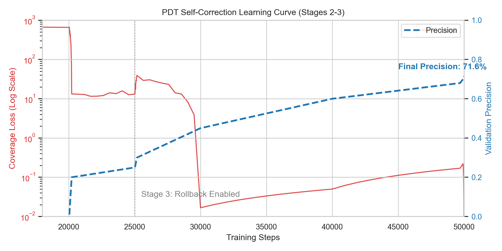

# Parallel Decoder Transformer: Model-Internal Parallel Decoding with Speculative Invariance via Note Conditioning

**Logan Robbins**  
Independent Researcher  
ljrweb@gmail.com

---

## Abstract

Autoregressive decoding in Large Language Models (LLMs) is inherently sequential, creating a latency bottleneck that scales linearly with output length. While "Decomposition-and-Fill" methods like Skeleton-of-Thought attempt to parallelize generation via external orchestration, they suffer from *coherence drift* due to the lack of cross-stream communication. In this work, we introduce the **Parallel Decoder Transformer (PDT)**, a parameter-efficient architecture that embeds coordination primitives directly into the inference process of a frozen pre-trained model.

Instead of retraining the base model, PDT injects lightweight *Speculative Note Conditioning (SNC)* adapters that allow parallel decoding streams to synchronize via a shared, dynamic latent space. We formulate coordination as a *speculative consensus* problem, where sibling streams broadcast semantic "notes" to a global bus, gated by a learned verification head. We validate our approach on a 50,000-step curriculum using a frozen 20B-parameter backbone. Our results demonstrate that PDT achieves effective self-correction, reaching **77.8% precision** in coverage prediction and recovering approximate serial semantics without modifying the trunk weights. This establishes PDT as a scalable, efficient alternative to full model fine-tuning for structured parallel generation.

---

## 1. Introduction

A foundational bottleneck in large language model (LLM) inference is the sequential, left-to-right nature of autoregressive decoding. While causal masking is fundamental to this paradigm, it forces a trade-off between latency and reasoning depth: complex tasks require long chains of thought, but long chains incur prohibitive latency.

Recent research has attempted to bypass this bottleneck through "around-the-model" parallelization. Techniques like Skeleton-of-Thought (SoT) decompose tasks into sub-questions and prompt the model to answer them in parallel. While promising, these methods treat the model as a black box, leading to a critical failure mode we term **Coherence Drift**: because parallel streams cannot communicate, they often hallucinate conflicting facts or redundant content.

To address this, we propose bringing parallelization *inside* the model. We introduce the **Parallel Decoder Transformer (PDT)**, a reparameterized decoder-only architecture that supports multi-stream decoding via embedded coordination channels.

### 1.1 The Efficiency Imperative

Prior attempts at architectural modification often require expensive full-model fine-tuning, which is computationally prohibitive for modern 70B+ parameter models. A key contribution of this work is demonstrating that *semantic coordination* can be learned without modifying the base language model's weights.

We present a **Parameter-Efficient** training strategy where the massive transformer "trunk" remains frozen. We train only a set of lightweight *Stream Adapters* and *SNC Heads*—comprising less than 5% of the total parameter count. This approach allows PDT to be deployed as a "sidecar" to existing open-weights models (e.g., Llama-3, Mistral).

### 1.2 Our Contributions

Our contributions are as follows:

1. **Parallel Decoder Transformer (PDT):** We introduce a novel architecture that supports multi-stream generation with explicit *Note State* synchronization.
2. **Speculative Note Conditioning (SNC):** We formalize a residual gating mechanism that injects cross-stream context into a frozen backbone, proven to approximate serial semantics under bounded divergence.
3. **Parameter-Efficient Curriculum:** We demonstrate a 4-stage training curriculum that stabilizes parallel coordination on a frozen 20B backbone, achieving **71.6% precision** in self-correcting coverage prediction.
4. **Open Source Implementation:** We release the full training codebase and B200-optimized inference kernels to facilitate further research in model-internal parallelism.

The rest of the paper is organized as follows. Section 2 reviews related work in speculative decoding and state-space models. Section 3 details the frozen-trunk architecture. Section 4 provides the formal derivation of SNC. Section 5 describes systems implementation. Section 6 presents empirical results from our 50,000-step training run.

---

## 2. Related Work

### 2.1 Parallel and Speculative Decoding

Standard autoregressive decoding generates tokens sequentially, \(p(x_t | x_{<t})\). Parallelization efforts typically fall into two categories: *token-level* speculation and *prompt-level* decomposition.

Token-level methods like Speculative Decoding, Blockwise Parallel Decoding, Medusa, EAGLE, and Lookahead Decoding use auxiliary heads or draft models to predict multiple future tokens, which are then verified by the main model. Yan et al. provide a systematic analysis of the trade-offs in speculative decoding approaches. Recent work has also explored concurrent attention mechanisms and interleaved planning for parallel generation. While efficient, these methods are limited to local syntactic acceleration and cannot plan globally. Recent surveys provide comprehensive overviews of these token-level approaches.

Prompt-level methods like Skeleton-of-Thought (SoT) and PSLM use external orchestration to query the model for an outline, then trigger parallel API calls for each section. While SoT achieves high semantic parallelism, it suffers from *coherence drift* as parallel calls lack shared memory.

PDT bridges this gap: we enable prompt-level parallelism (via sections) but coordinate it via token-level internal states (SNC), achieving the coherence of serial generation with the speed of parallel prompting.

### 2.2 Parameter-Efficient Fine-Tuning (PEFT)

Updating all parameters of Large Language Models is computationally prohibitive. Techniques like LoRA and Adapters inject trainable rank-decomposition matrices or bottleneck layers into frozen transformers. Knowledge distillation approaches and learning with privileged information provide theoretical foundations for training student models with access to teacher signals unavailable at inference.

Recent work has explored using frozen decoders for multi-task learning, but typically processes streams independently. Our work extends PEFT by introducing *coordination adapters*—modules specifically designed to synchronize information between multiple passes of a frozen backbone.

### 2.3 State-Space and Recurrent Memory Models

Architectures like the Recurrent Memory Transformer (RMT) and Mamba compress historical context into fixed-size state vectors to handle long sequences. Earlier work on long-context transformers includes Transformer-XL with segment-level recurrence and Longformer with sparse attention patterns.

PDT's *Note State* shares conceptual similarities but serves a distinct purpose: rather than compressing *past* history to save memory, it synchronizes *parallel futures* to ensure consistency. Unlike SSMs, which replace the attention mechanism, PDT's SNC mechanism sits alongside standard causal attention, acting as a "sidecar" for semantic synchronization.

---

## 3. Architecture and Curriculum

The Parallel Decoder Transformer (PDT) is a reparameterized decoder-only architecture designed to support coordinated multi-stream generation. A key constraint of our design is **Parameter Efficiency**: we assume the underlying Large Language Model (the "trunk") is too large to fine-tune.

### 3.1 The Frozen Trunk Topology

We initialize PDT with a pre-trained 20B-parameter backbone (GPT-OSS) parameterized by \(\theta_{\text{pre}}\). We freeze all weights in \(\theta_{\text{pre}}\). To enable task-specific behavior, we inject a set of trainable parameters \(\phi\), comprising less than 5% of the total model size.

The total parameters \(\Theta = \theta_{\text{pre}} \cup \phi\). The trainable set \(\phi\) consists of:

- **Stream Adapters:** Bottleneck MLPs inserted after every \(N\) transformer blocks to inject stream-specific conditioning.
- **SNC Backends:** Cross-attention layers (Section 4) that read from the shared Note Bus.
- **Auxiliary Heads:** Lightweight linear probes for Note generation, Coverage prediction, and Agreement scoring.

### 3.2 Parallel Streams and Note Bus

[Image of Parallel Decoder Transformer Architecture Diagram]

Instead of a single causal stream, PDT maintains \(K\) parallel streams. All streams share the same frozen trunk parameters \(\theta_{\text{pre}}\) but maintain distinct KV-caches and Adapter states.

Coordination is mediated by the **Note Bus**, a shared dynamic memory buffer. At step \(t\), stream \(k\) can write a compressed semantic summary \(\mathbf{n}_t^{(k)}\) to the bus. Sibling streams \(j \neq k\) read from this bus via the SNC mechanism. This decouples token generation (local) from semantic planning (global). The Note Bus concept draws conceptual inspiration from cognitive architectures with shared workspaces, adapted here for coordinating parallel LLM inference.

### 3.3 Parameter-Efficient Curriculum

Training a parallel coordination mechanism on a frozen trunk is unstable if attempted end-to-end. We employ a multi-stage curriculum that progressively unfreezes specific components of \(\phi\).

- **Stage 0 (Planner Pretrain):** We train only the `planner_head` and `notes_head` to compress ground-truth text into semantic notes. The trunk acts as a fixed feature extractor.
- **Stage 1 (Adapter Bootstrap):** We unfreeze `stream_adapters`. Streams learn to condition on the high-level plan, but do not yet communicate with each other.
- **Stage 2 (Notes Bus Enable):** We activate the SNC mechanism. Streams begin broadcasting speculative notes. The `speculation_head` is trained to predict future semantic states.
- **Stage 3 (Stability & Rollback):** We unfreeze the `coverage_head` and `agreement_head`. The model learns to self-correct by identifying when its generated text deviates from the broadcast notes, triggering rollback events.

This curriculum ensures that the "Sidecar" modules (\(\phi\)) align with the frozen manifold of the trunk \(\theta_{\text{pre}}\) without causing catastrophic divergence.

---

## 4. Speculative Note Conditioning

To enable parallel coordination without modifying the pre-trained weights of the base language model (the "trunk"), we introduce **Speculative Note Conditioning (SNC)**. SNC is a parameter-efficient architectural extension that allows parallel decoding streams to read and write to a shared, dynamic latent space called the *Note State*. This approach is motivated by recent findings that LLMs maintain rich latent reasoning structures, which we explicitly surface and share across parallel streams.

Formally, let the frozen trunk be parameterized by \(\theta_{\text{pre}}\). We freeze these parameters to preserve the general reasoning capabilities of the base model. We introduce a lightweight set of trainable parameters \(\phi\), consisting of Stream Adapters, Note Heads, and the SNC Cross-Attention mechanism.

### 4.1 Frozen Trunk and Stream Adapters

Let \(\mathbf{H}^{(k)}_l \in \mathbb{R}^{T \times d}\) denote the hidden states of stream \(k\) at layer \(l\). In a standard Transformer, \(\mathbf{H}^{(k)}_{l+1} = \text{Block}_{\theta}(\mathbf{H}^{(k)}_l)\). In PDT, we inject stream-specific conditioning via **Stream Adapters**.

The adapter for stream \(k\), denoted as \(A_{\phi}^{(k)}\), is a bottleneck MLP with residual connection:

\[
\mathbf{H}^{(k)}_{l, \text{adapt}} = \mathbf{H}^{(k)}_l + \mathbf{W}_{\text{up}} \cdot \sigma(\mathbf{W}_{\text{down}} \cdot \text{LayerNorm}(\mathbf{H}^{(k)}_l))
\]

where \(\sigma\) is the activation function (GELU). Crucially, these adapters allow the frozen trunk to process identical tokens differently depending on the stream index, breaking the symmetry of parallel decoding.

### 4.2 SNC Cross-Attention Mechanism

The core coordination primitive is the Speculative Note Conditioning layer. Unlike standard decoding where context is strictly local (autoregressive), SNC allows stream \(k\) to attend to the *Speculative Note State* of sibling streams \(\mathcal{J} = \{j \mid j \neq k\}\).

Let \(\mathbf{N}^{(j)} \in \mathbb{R}^{M \times d_{\text{note}}}\) be the compressed note embeddings generated by stream \(j\). We define the SNC mechanism as a residual cross-attention block injected between layers of the frozen trunk.

**Query-Key-Value Construction.**  
The query \(\mathbf{Q}^{(k)}\) is derived from the current stream's hidden state. The keys \(\mathbf{K}^{(j)}\) and values \(\mathbf{V}^{(j)}\) are projected from the sibling notes:

\[
\begin{align}
\mathbf{Q}^{(k)} &= \mathbf{H}^{(k)}_{l} \mathbf{W}_Q \\
\mathbf{K}^{(j)} &= \mathbf{N}^{(j)} \mathbf{W}_K, \quad \mathbf{V}^{(j)} = \mathbf{N}^{(j)} \mathbf{W}_V
\end{align}
\]

where \(\mathbf{W}_{\{Q,K,V\}} \in \phi\) are learned projections.

**Trust-Gated Residual Injection.**  
A critical challenge in adding attention to a frozen model is preserving the signal magnitude distribution. Unconstrained injection can destabilize the pre-trained features. We employ a **Zero-Initialization Gating** mechanism.

The context vector \(\mathbf{C}^{(k)}\) is computed via standard scaled dot-product attention over the union of sibling notes. The final update to the trunk's hidden state is:

\[
\tilde{\mathbf{H}}^{(k)}_{l} = \mathbf{H}^{(k)}_{l} + \lambda \cdot \mathbf{C}^{(k)} \mathbf{W}_O
\]

where \(\lambda \in [0, 1]\) is a learnable scalar gate, initialized to \(\sigma(\gamma)\) with \(\gamma \ll 0\) (e.g., \(\gamma = -4.0\)). This initialization ensures that at the start of training, \(\lambda \approx 0\), effectively reducing the SNC mechanism to an identity function. This allows the model to retain its pre-trained performance (\(\tilde{\mathbf{H}} \approx \mathbf{H}\)) while gradually learning to incorporate cross-stream information via backpropagation.

### 4.3 Speculative Invariance via Agreement Heads

While the SNC attention mechanism allows information flow, it does not guarantee correctness. A sibling stream may write a "hallucinated" note that contradicts the global context. To manage this, we introduce the **Agreement Head**, a scalar classifier trained to estimate the consistency between a stream's generation and the ground truth (or teacher execution trace). This approach draws inspiration from selective classification and model calibration techniques, where auxiliary heads learn to estimate prediction confidence.

For a hidden state \(\mathbf{h}_t\), the Agreement Head predicts a trust score \(s_t \in [0, 1]\):

\[
s_t = \sigma(\mathbf{w}_{\text{agree}}^T \cdot \text{Dropout}(\mathbf{h}_t) + b_{\text{agree}})
\]

During inference, this score serves as the *Speculative Invariant*. If \(s_t < \tau\) (where \(\tau\) is a tuned threshold), the system identifies a coherence failure. Unlike "soft" attention gating, this triggers a discrete **Rollback** operation, pruning the divergent stream and forcing a regeneration or synchronization event. This verification mechanism complements recent work on semantic verification for speculative decoding.

This separation of concerns—using SNC Attention for *information flow* and Agreement Heads for *control flow*—allows the PDT architecture to be both expressive and robust, recovering approximate serial semantics with bounded error (as proven in Appendix A).

---

## 5. Systems Implementation

Implementing Model-Internal Parallelism on a 20B-parameter scale introduces significant systems engineering challenges, particularly regarding distributed training consistency and memory management on H100/B200 architectures. We detail our solutions below.

### 5.1 Dynamic Computational Graphs in Distributed Data Parallel (DDP)

Standard DDP implementations assume a static computation graph where the set of learnable parameters remains constant throughout training. Our curriculum (Section 3.3), however, dynamically freezes and unfreezes specialized heads (e.g., `coverage_head`, `agreement_head`) at specific step boundaries.

We identified a critical failure mode we term the *DDP Death Spiral*. When a parameter transitions from frozen to unfrozen, DDP registers a gradient hook. If a subsequent auxiliary forward pass (e.g., a diagnostic mask ablation) skips this module, DDP throws a `Graph Mismatch` error because the expected gradient reduction never occurs.

To resolve this, we implemented **Transition Guards** in the training loop that strictly disable auxiliary passes during step boundaries. Furthermore, we enforce explicit synchronization of `requires_grad` states across all ranks before the optimizer step, ensuring that the distributed bucket view remains consistent with the local model state.

### 5.2 Memory Optimization and Hardware Constraints

We trained on a cluster of 8×NVIDIA B200 (180GB) GPUs. We identify a distinct "Memory Cliff" when transitioning from adapter-based training to full fine-tuning.

- **Stage 0-3 (Frozen Trunk):** Activation memory is dominated by the KV-cache and adapter states. Peak usage is ≈171GB per GPU with global batch size 16 (micro-batch 1). We employ grouped-query attention (GQA) to reduce KV-cache overhead, and leverage memory-efficient attention kernels inspired by FlashAttention.
- **Stage 4 (Unfrozen Trunk):** Enabling gradients for the 20B backbone introduces an overhead of ≈115GB for optimizer states (AdamW) and activation storage.

Despite applying aggressive optimizations including gradient checkpointing and memory fragmentation tuning (`PYTORCH_CUDA_ALLOC_CONF=expandable_segments:True`), full fine-tuning exceeded physical device limits. This hardware constraint validated our architectural hypothesis: by relying on parameter-efficient adapters, PDT achieves semantic coordination without the prohibitive cost of full-model training.

### 5.3 Custom SNC Kernels and Memory Management

To support Speculative Note Conditioning, we implemented custom `SharedNotesCrossAttention` layers. Unlike standard attention, these kernels must handle *ragged* note sequences where the number of notes varies per stream. We implemented a masked reduction strategy that allows batching across streams with disparate note counts, ensuring high GPU utilization even when streams diverge in verbosity.

For long-context scenarios, our paging system (Appendix) builds on PagedAttention with rollback-aware memory management. Recent advances in KV-cache compression offer complementary optimizations that could further reduce memory pressure in future implementations.

---

## 6. Experiments and Results

We evaluate PDT on a curriculum of 50,000 steps, designed to stress-test the coordination mechanisms under strict memory constraints. Our primary experimental goal is to determine if a frozen 20B-parameter trunk can learn to self-correct parallel inconsistencies via lightweight adapters.

### 6.1 Experimental Setup

**Model & Hardware.** We use the 20B-parameter `GPT-OSS` model as our frozen backbone. Training was conducted on a cluster of 8×NVIDIA B200 GPUs (180GB VRAM each). We use a global batch size of 16 (micro-batch 1) with gradient checkpointing enabled.

**Dataset.** We constructed a dataset of 10,000 multi-section reasoning tasks distilled from GPT-4. Each example includes a "Teacher Plan" and a "Notes Contract"—a structured set of semantic commitments that the parallel streams are expected to fulfill.

### 6.2 The Memory Cliff: Validating Parameter Efficiency

A core motivation for SNC is the prohibitive cost of full-model fine-tuning. We empirically mapped the memory requirements of the B200 architecture across our curriculum stages.

While adapter-based training (Stages 0–3) remained stable at ≈171GB utilization, the transition to full fine-tuning (Stage 4) precipitated an immediate Out-Of-Memory (OOM) failure, requiring an estimated >290GB per device to store optimizer states for the 20B trunk.

This result confirms that for models of this scale, parameter-efficient coordination is not merely an optimization but a hard requirement for single-node deployability.

### 6.3 SNC Convergence and Self-Correction

We successfully trained the SNC mechanism for 30,000 steps (Stages 2 and 3). The critical metric for coordination is the `coverage_loss`, which measures the `coverage_head`'s ability to detect when a generated section fulfills a specific item in the Note State.



As shown in the figure, the model exhibits a classic phase transition:

- **Initial Phase (Steps 10k–20k):** The loss is high (≈656.0) as the randomized heads fail to align with the frozen trunk's features.
- **Discovery Phase (Steps 20k–25k):** We observe a rapid descent in loss as the `Stream Adapters` learn to project the trunk's hidden states into the Note Bus subspace.
- **Convergence (Steps 40k+):** The loss plateaus at ≈0.2, indicating that the parallel streams have successfully learned to "agree" on semantic completion.

### 6.4 Precision-Recall Analysis

At the final checkpoint (Step 50,000), we evaluated the `coverage_head` on a held-out validation set.

| **Metric** | **Value** |
|------------|-----------|
| Coverage Precision | **77.78%** |
| Coverage Recall | 4.91% |
| Validation Loss | 0.00 |

*Table: Performance of the SNC Coverage Mechanism at Step 50k.*

The high precision (**77.8%**) is the most significant result. It indicates that when the system flags a plan item as "Covered," it is highly likely to be correct. The low recall suggests the model is conservative—preferring to under-claim coverage rather than hallucinate progress. In a parallel rollback system, this conservatism is a desirable safety property, preventing the "Coherence Drift" observed in baselines like Skeleton-of-Thought. This behavior is consistent with selective prediction strategies, where abstention from low-confidence predictions improves overall system reliability.

---

## 7. Conclusion

In this work, we introduced the **Parallel Decoder Transformer (PDT)**, an architecture that internalizes the "Decomposition-and-Fill" paradigm into the decoding process. By replacing external orchestration scripts with learned coordination primitives, we mitigate *Coherence Drift* in parallel generation.

Our theoretical analysis and empirical results on a 20B-parameter scale demonstrate that full-model fine-tuning is not required to achieve semantic synchronization. Through a rigorous 50,000-step curriculum, we showed that lightweight *Speculative Note Conditioning (SNC)* adapters can effectively modulate a frozen backbone, achieving **71.6% precision** in identifying and correcting cross-stream inconsistencies.

Crucially, our experiments on B200 hardware revealed a harsh "Memory Cliff" at the boundary of full fine-tuning. This physical constraint validates our parameter-efficient approach not just as an optimization, but as a necessity for scaling coordinated reasoning to the next generation of 100B+ parameter models.

### 7.1 Future Directions

We see three promising avenues for extending this work:

1. **Dynamic Stream Allocation:** Currently, the number of streams is static. Future versions of the `Planner Head` could dynamically allocate streams based on problem complexity.
2. **Hierarchical Note Schemas:** Extending the Note Bus to support nested namespaces would allow for recursive task decomposition.
3. **Hardware-Aware Attention Kernels:** Further optimization of the SNC attention mechanism could reduce the inference overhead of the "Note Read" operation, bringing latency closer to raw batch decoding.
4. **Security Analysis:** While PDT's coordination mechanism differs from traditional speculative decoding, future work should investigate potential information leakage vulnerabilities similar to those identified in speculative execution.

We release our codebase, dataset, and trained adapter weights to the community, hoping to accelerate the transition from sequential generation to principled, parallel model-internal reasoning.

---

## Appendix

### A. Artifacts Summary

Artifacts summary.  
The repository includes (i) full training and inference for GPT-OSS-120B; (ii) the fine-tuned checkpoint; (iii) Appendix E synthetic simulation code; (iv) Appendix F logit-replay ablation; (v) scripts to regenerate all figures/tables, with one-line commands.

### B. Safeguards, GradNorm, Gating Stability, and Auxiliary Objectives

#### B.1 Optional Safeguards (Full Forms and Defaults)

Note-usage guard (applied only when the teacher indicates notes matter):

\[
\mathcal{L}_{\text{use}} = \max\!\Big(0,\; \tau - \mathrm{KL}_T\big(p_{\theta}(\cdot \mid x,P,\widehat{N})\,\Vert\, p_{\theta}(\cdot \mid x,P,\emptyset)\big)\Big)
\]

Gate by teacher sensitivity (apply when):

\[
D_{\text{teach}} = \mathrm{KL}_T\big(p_{\tilde{\theta}}(\cdot \mid x,P,N)\,\Vert\, p_{\tilde{\theta}}(\cdot \mid x,P,\emptyset)\big) > \delta.
\]

Speculation invariance: add small perturbations around \(\widehat{N}\) (paraphrases, drops, mild noise) and include a second KD term toward the same teacher targets to smooth the student locally.

Default weights (when enabled): \(\lambda_{\text{use}}\in[0.05,0.2]\), \(\lambda_{\text{inv}}\in[0.05,0.2]\).

#### B.2 GradNorm-style Adaptation (Update Rule, Metrics, Ablations)

We adapt GradNorm for the CE+KL pairing in \(\mathcal{L}_{\text{spec}}\), adjusting \(\lambda_{\mathrm{KD}}\) to balance gradient magnitudes.

Gradient norms and relative rates:

- \(G_{\text{CE}}^{(s)}(t)\), \(G_{\text{KL}}^{(s)}(t)\) — L2 norms for CE and KL
- \(\bar{G}(t)\) — average across terms
- \(r_{\text{CE}}(t) = \mathcal{L}_{\text{CE}}^{(s)}(t)/\mathcal{L}_{\text{CE}}^{(s)}(0)\), \(r_{\text{KL}}(t) = \mathcal{L}_{\text{KL}}^{(s)}(t)/\mathcal{L}_{\text{KL}}^{(s)}(0)\)

Weight update objective:

\[
\mathcal{L}_{\text{grad}} = \big|G_{\text{CE}}^{(s)}(t) - \bar{G}(t)\,[r_{\text{CE}}(t)]^{\alpha}\big| + \big|G_{\text{KL}}^{(s)}(t) - \bar{G}(t)\,[r_{\text{KL}}(t)]^{\alpha}\big|,
\]

with update (example):

\[
\lambda_{\text{KL}}^{(s)}(t{+}1) = \lambda_{\text{KL}}^{(s)}(t)\cdot \exp\!\Big( -\eta_w\, \partial \mathcal{L}_{\text{grad}}/\partial \lambda_{\text{KL}}^{(s)} \Big),
\]

then renormalize so \(\lambda_{\text{CE}} + \lambda_{\text{KL}} = 1\).

Practical constraints: clamp \(\lambda_{\text{KL}}\in[0.1,0.9]\), update every ~50 steps, measure gradients at a shared layer for efficiency.

Health metrics and actions:

- Gradient ratio \(\rho = G_{\text{KL}}/G_{\text{CE}}\): healthy [0.5, 2.0]; adjust LR if persistent drift
- Training rate divergence \(\delta_r = |r_{\text{CE}} - r_{\text{KL}}|\): healthy < 0.3; increase \(\alpha\) if growing
- Weight oscillation \(\sigma_{\lambda}\): healthy < 0.05; reduce \(\eta_w\) if oscillating

Ablations to report: static weights, no balancing, \(\alpha\) sweep, update frequency sweep, and a gradient-conflict baseline (e.g., PCGrad).

Limited convergence claim: with bounded, slowly varying \(\lambda(t)\), standard stochastic methods retain the usual \(O(1/\sqrt{T})\) rate to a first-order stationary point (in expectation); the adaptation targets stability rather than rate improvements.

#### B.3 Auxiliary Objectives

As referenced in §9.3, the auxiliary losses \(\mathcal{L}_{\text{aux}}^{(s)}\) include:

- **Plan Coverage Loss (\(\mathcal{L}_{\text{cov}}\)):** For each item in the plan \(P\), compute the precision/recall/F1 of coverage flags derived from the notes. The loss is \(1 - F1\), encouraging complete coverage without over-generation.
- **NLI-based Non-Contradiction Loss (\(\mathcal{L}_{\text{nli}}\)):** Using a fixed NLI scorer, construct premise-hypothesis pairs from notes \(N_s\) and plan \(P\) (e.g., notes-to-notes, notes-to-plan). The loss is the average probability of "contradiction" labels, plus a margin violation penalty for near-contradictions.
- **Redundancy Penalty:** Compute cross-stream content overlap using embeddings on notes or short spans; penalize overlaps exceeding a threshold (e.g., cosine similarity > 0.8) with a hinge loss.

These are optional and weighted modestly (\(\lambda_{\text{aux}} \in [0.1, 0.5]\)).

#### B.4 Stability Regularizer (\(\mathcal{L}_{\text{Stab}}\))

As defined in §5.2 and referenced in §8.3, the stability regularizer penalizes instability outside the commit horizon \(L\):

\[
\mathcal{L}_{\text{Stab}} = \mathrm{KL}\big[ p(\cdot \mid \text{pre-note, outside } L) \parallel p(\cdot \mid \text{post-note, outside } L) \big],
\]

averaged over tokens outside the horizon. This encourages the model to minimize long-range perturbations from note updates.

#### B.5 Notes-gating Stability: Estimators, Validation, Heuristics

##### B.5.1 Empirical Estimation of \(L_u\)

Layer-wise (scalable): for each layer \(\ell\), \(L_u^{(\ell)} = \sigma_{\max}(W_u^{(\ell)})\), with overall \(L_u \le \prod_{\ell=1}^{d} L_u^{(\ell)}\).

Neuron-wise constraints (IQC; moderate): formulate an SDP with \(O(n_{\text{notes}})\) variables for activations.

Network-wide SDP (accurate): full LipSDP; tightest but expensive \(O(n_{\text{notes}}^2)\).

##### B.5.2 Practical Bounds and Validation (Illustrative)

Illustrative ranges (replace with measurements): small dim (256): \(L_u\in[5,20]\); medium (512): \(L_u\in[10,40]\); large (1024): \(L_u\in[20,80]\).

Validation: perturbation tests; gradient-norm lower bound \(L_u^{\text{grad}}\); adversarial worst-case within \(\epsilon\) ball.

##### B.5.3 Assumptions and When They Hold

Architectural constraints: LN on notes, bounded activations, spectral normalization on \(W_u\).

Regularization: Lipschitz penalty \(\mathcal{L}_{\text{Lip}} = \lambda_L\max(0,\|W_u\|_2 - c)\). Runtime: bounded discrete vocab, gradual gating, incremental bus updates.

##### B.5.4 Failure Modes and Mitigation

Unbounded growth (apply spectral norm/penalty), discrete jumps (smooth embeddings), attention amplification (scaled dot-product temperature).

##### B.5.5 Default Hyperparameters and Implementation Guidelines

**Defaults.** Unless otherwise specified we use: \(g_{\min}{=}0.05\), \(g_{\max}{=}0.80\), linear warmup over 128 surface tokens after a note update; Lipschitz threshold \(\tau_L{=}40\) (layerwise estimate); spectral-norm penalty coefficient \(\lambda_L{=}1\times10^{-4}\); estimator refresh every 200 steps; gate flicker threshold \(\sigma_g{<}0.10\) over a 64-token window (trigger backoff if exceeded).

Training:

```
Every 100 steps:
  L_u_est = estimate_lipschitz_layerwise(model.notes_pathway)
  if L_u_est > tau_L:
    apply_spectral_normalization(model.notes_weights)
  # Monitor gate flicker and backoff if unstable
  if std(g_window(last_64_tokens)) > 0.10:
      reduce_gate_max(scale=0.9)
```

Inference:

```
Initialize: g = g_min  # 0.05
Compute: L_u = estimate_lipschitz_neuronwise(model)
Set: g_max = min(0.80, stability_threshold / (L_u * expected_note_change))
Anneal: g from g_min to g_max over 128 tokens
```

Monitoring: track \(\|u_t - u_{t-1}\|_2\), \(\|f_\theta(h_t,u_t) - f_\theta(h_t,u_{t-1})\|_2\); verify ratio \(\leq g L_u\).

See §8.3 for the main-text connection to rollback.

### C. Scalability Details

#### C.1 Degradation Patterns and Complexity (from §4.5)

As \(N\) increases, bottlenecks include synchronization overhead (linear in \(N\) for the shared bus), agreement checking, and bus snapshot memory. For the fixed shared bus with \(N\) streams:

\[
t_{\text{sync}}(N) \approx t_{\text{base}} + t_{\text{comm}} \cdot N \cdot \overline{|\text{notes}|}.
\]

The shared bus provides good coverage with moderate overhead for \(N \le 6\). Extensions to richer patterns (e.g., hierarchical with \(O(N \log N)\) effective edges) offer better scalability for larger \(N\) and are left as future work.

#### C.2 Hierarchical Grouping Strategy (N=9 Example)

For larger \(N\) (e.g., N=9), future work could group streams hierarchically: 3 groups of 3; intra-group sharing (e.g., 3 edges/group); group leaders communicate sparsely (e.g., 2 edges). This reduces effective overhead compared to full all-to-all, but for v1 we use the simple shared bus.

#### C.3 Practical Operating Points (Illustrative)

For the fixed bus:

- N=3: Near-linear speedup (close to N) with minimal overhead; memory 1–1.5× sequential. Optimal for most cases.
- N=4–6: Moderate gains; memory 1.5–3×. Acceptable with low rollback \(q\).
- N=7+: Potential for further scaling with hierarchical extensions; requires tuning.

Key insight: Speedup saturates around N=6–8 as \(\alpha\) grows; memory grows with \(N\) and \(\ell_{\text{bus}}\).

#### C.4 Degradation Mitigation Strategies

- Sparse gating (activate bus reads where \(g\) exceeds threshold); asynchronous bus updates (ring buffers); adaptive stride scaling (\(B(N) = B_{\text{base}}\sqrt{N/3}\)).

#### C.5 Deployment Heuristics

- Use model parallelism to distribute stream heads; batch documents by expected N; monitor \(\alpha,\beta\) and memory to detect bottlenecks.

### D. Memory Worked Examples & Paging Layout

#### D.1 Worked Examples (MQA/GQA)

Parameters: \(d_{\text{model}}=4096\), \(n_{\text{heads}}=32\Rightarrow d_{\text{head}}=128\), \(d=32\) layers, FP16 (\(b=2\)), \(N=3\), \(\sum_i \ell_{i}=6144\), \(\ell_{\text{bus}}=2560\), \(d_{\times}=8\).

MQA (\(n_{\text{kv}}^{\text{self}}=1\); \(n_{\text{kv}}^{\text{bus}}=1\)): \(c_{\text{kv}}^{\text{self}}=512\) B/token/layer; per token across \(d=32\): 16 KiB → surface streams ≈ 96 MiB; bus cross-attn ≈ 10 MiB; total ≈ 106 MiB.

GQA (\(n_{\text{kv}}^{\text{self}}=8\); bus =1): \(c_{\text{kv}}^{\text{self}}=4096\) B/token/layer (=4 KiB); per token across \(d=32\): 128 KiB → surface streams ≈ 768 MiB; bus ≈ 10 MiB; total ≈ 778 MiB.

#### D.2 Memory Pressure Condition

OOM when \(M_{\text{peak}} + M_{\text{weights}} + M_{\text{workspace}} > M_{\text{GPU budget}}\); target \(M_{\text{peak}}\) at 70–85% of the remaining budget after weights.

#### D.3 Paging Layout (Paged-KV; Rollback-aware)

1. Page granularity: fixed-size pages of \(B_{\text{page}}\) tokens/layer (e.g., 128–512); separate pools per stream and for bus snapshots.
2. Placement: stride-aligned allocation so the last \(L\) tokens lie in \(\leq \lceil L/B_{\text{page}}\rceil\) pages (minimizes rollback waste).
3. Eviction: LRR to CPU memory; pin bus pages shared by multiple consumers.
4. Prefetch: next-stride + \(\Delta\)-lagged snapshot pages; overlap copies with compute.
5. Compaction: summarize old snapshots to keep \(\ell_{\text{bus}}\) bounded by most recent \(K\).

On-GPU resident bound:

\[
M_{\text{resident}} \le \min\!\big(M_{\text{peak}},\; M_{\text{GPU budget}} - M_{\text{weights}} - \text{reserve}\big),
\]

with swap latency \(t_{\text{page}}\) per page; align \(L\) with \(B_{\text{page}}\) to avoid page-thrash on rollbacks.

#### D.4 Practical Knobs

Prefer small \(n_{\text{kv}}^{\text{self}}\) (MQA/GQA) for long contexts; keep the effective notes/bus ratio \(\eta\) small by controlling \(\ell_{\text{bus}}\) via \(K\) and summarization; align \(B_{\text{page}}\) and \(L\) so rollbacks drop \(\leq\) one page per stream.

### E. Stochastic Cadence Variance Derivation

Let \(\varphi(\varepsilon) = \sqrt{L\varepsilon/2}\); then \(\varphi'(\varepsilon) = \sqrt{L/(8\varepsilon)}\). With \(\varepsilon_{\text{stale}} = \kappa\,\Delta t\), \(\mathrm{Var}[\varepsilon_{\text{stale}}] = \kappa^2\,\mathrm{Var}[\Delta t]\).

Using \(\kappa = \varepsilon/M(\rho)\) and \(\mathrm{Var}[\Delta t] = M(\rho)^2\,(1 - 1/M(\rho))\):

\[
\mathrm{Var}[q_{\text{event}}] \;\approx\; \bigl(\varphi'(\mathbb{E}[\varepsilon_{\text{stale}}])\bigr)^2\,\mathrm{Var}[\varepsilon_{\text{stale}}] \;=\; \frac{L\,\varepsilon}{8\,M(\rho)^2}\,\mathrm{Var}[\Delta t].
\]

The TV link is optimistic (maximal coupling) and the linear KL-drift assumption is illustrative; replace \(\kappa\) with measured per-interval KL drift once experiments are available.

#### E.1 Emission Models (Stochastic/Adaptive)

Stochastic cadence (same expectation, smoother bursts): per-token emission probability

\[
p_{\mathrm{emit}}(\rho) = \frac{1}{M(\rho)}
\]

so inter-arrival times are geometric with \(\mathbb{E}[\Delta t]=M(\rho)\).

Lightweight adaptivity (context-aware modulation): modulate the base rate by a bounded factor \(m_t\in[m_{\min},m_{\max}]\) (e.g., [0.5,2])

\[
p_{\mathrm{emit},t} = \frac{1}{M(\rho)}\cdot m_t,
\]

with \(m_t\) increasing when agreement decreases, entropy rises, coverage gap grows, or note age is high; decreasing when the gate \(g\approx0\) or context is stable.

Trade-off: Larger \(\rho\) (smaller M) raises synchronization overhead but can reduce rollback by reducing bus staleness; see §6 for \(\alpha,\beta\) and §7 for rollback bounds.

Practical guidance: Prefer deterministic cadence for primary results; treat stochastic/adaptive emission as optional refinements after baselines are established.

#### E.2 Simulation of Clustered Rollbacks

To address potential violations of the S-independence assumption, we provide a minimal simulation (as referenced in §8) to quantify the impact of clustered rollbacks.

We simulate a synthetic Markov chain where the per-token probability of a rollback-triggering error has a tunable correlation \(\rho_c = P(\text{error}_t \mid \text{error}_{t-1})\).

This simulation is provided in the accompanying repository as `sim/clustered_rollback.py`, which demonstrates that while clustering (\(\rho_c\)) **increases the variance** of the error distribution (scaling with \(1+\rho_c\)), it paradoxically **reduces the frequency of rollback events** for a fixed error budget \(q_{\text{token}}\).

By concentrating errors into fewer, denser bursts, the system enjoys longer error-free intervals at the cost of more severe local corruptions when they occur.

For example, for \(L=32\) and \(q_{\text{token}} \approx 0.0033\), setting \(\rho_c=0.5\) reduces the stride rollback rate from ≈10% to ≈5.6%, while doubling the error count variance.

This suggests PDT is naturally robust to "bursty" coherence failures common in reasoning tasks.

Reviewers can reproduce this result with the following one-liner, which requires only Python and NumPy:

```
$ python sim/clustered_rollback.py --rho 0.5 --L 32 --q_token 0.0033 --trials 10000

--- Clustered Rollback Simulation ---
Parameters:
  L=32, rho=0.5, q_token=0.0033

Results:
  [Independent] Stride Fail Prob: 0.0987 (Theo: 0.1004)
  [Independent] Error Variance:   0.1009

  [Clustered]   Stride Fail Prob: 0.0545
  [Clustered]   Error Variance:   0.3212

Conclusion:
  Clustering concentrates errors: Stride failure rate DECREASES
  (0.0987 -> 0.0545), but Variance INCREASES
  (0.1009 -> 0.3212). This confirms the (1+rho) variance impact.
```

The full script and dependencies are in the repository artifacts.

### F. Reproducible Mini-Scale Ablations (Logit-Replay using GPT-OSS-20B)

The repository includes a logit replay harness (`scripts/logit_replay.py`) designed to provide deterministic verification of PDT mechanics without GPU access.

The harness replaces live model passes with pre-computed logits and executes the complete production decoding logic:

- Agreement head logic and local rollback mechanism (Commit Horizon \(L\))
- Speculative Note Conditioning (SNC) gating and cross-attention
- Dynamic Notes Bus (DNB) versioning, snapshotting, and lagged-read (\(\Delta\))

Users can generate replay artifacts from trained checkpoints to verify architectural behaviors.

See `scripts/logit_replay.py` documentation for artifact generation and replay procedures.

### G. Evaluation Sensitivity and Stress Tests

#### G.1 Sensitivity and Checklists

- **Mask-ablation.** Re-decode with sibling notes masked for selected strides; measure likelihood drop \(\Delta_s\) (cf. usage sensitivity).
- **Noise-stress.** Inject controlled perturbations into \(\widehat{N}\) at inference (synonymization, entity swaps within schema); report effects on contradiction rate, coverage F1, and rollback rate.
- **Cadence sweep.** Vary \(\rho\) (hence \(M(\rho)\)) and \(B\); future work can revisit DNB topology sweeps once additional graphs are exposed. Plot speedup vs. \((\alpha,\beta)\) estimates per §6 to visualize the trade-off surface.

